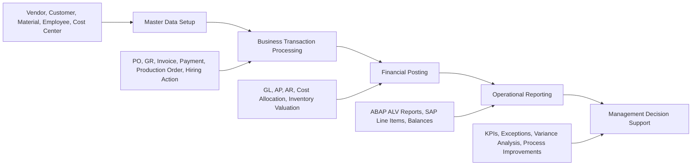

# SAP S/4HANA ERP Portfolio — Executive Showcase

## Purpose

This section converts the existing SAP S/4HANA academic projects into a recruiter-ready portfolio narrative. It is designed to help hiring managers quickly understand the business processes implemented, the SAP modules covered, the analytics value created, and how the work maps to ERP, SAP, Accounting, Data Analytics, and Business Analytics roles.

The repository already contains module-level project evidence for FI/CO, MM, PP, ABAP, and HCM. This showcase layer adds the professional framing that employers usually look for: business problems, process ownership, KPIs, SAP tables, analytics opportunities, and resume-ready talking points.

---

## Portfolio Positioning Statement

> Built and documented end-to-end SAP S/4HANA business process projects across Financial Accounting, Controlling, Materials Management, Production Planning, ABAP reporting, and Human Capital Management. Demonstrated practical understanding of enterprise structure, master data, transaction processing, FI-MM integration, FI-SD reporting, procure-to-pay, production execution, cost center allocation, and workforce administration. Extended the portfolio with business analytics thinking by identifying KPIs, process risks, reporting opportunities, and decision-support use cases.

---

## Executive Summary

| Portfolio Area | Business Process | Business Value Demonstrated | Employer-Relevant Skill |
|---|---|---|---|
| FI / CO | General ledger, A/P, A/R, cost centers, assessment cycles | Accurate financial posting, vendor/customer clearing, cost allocation, financial control | Accounting operations, SAP FI/CO, month-end support |
| MM | Procure-to-pay, RFQ, PO, goods receipt, invoice verification, payment | Procurement control, vendor selection, three-way matching, inventory accuracy | Procurement analytics, SAP MM, P2P process support |
| PP | MRP, BOM, routing, production order, confirmation, goods receipt | Manufacturing planning, demand fulfillment, production visibility | Supply chain analytics, production operations, SAP PP |
| ABAP | Custom A/R and A/P reporting using SAP tables | Faster access to cleared item reporting and customer/vendor visibility | ERP reporting, SQL-like table joins, data extraction logic |
| HCM | Organizational management, qualifications, hiring action | Workforce structure management and recruitment process execution | HR process analysis, SAP HCM fundamentals |

---

## End-to-End Business Process Coverage

This flow shows that the projects are not isolated SAP exercises. Together, they represent how ERP master data, operational execution, financial integration, and analytics reporting connect inside an enterprise system.

---

## Business Analyst View of the Portfolio

### 1. Financial Accounting and Controlling

**Business question answered:**  
Can the organization reliably post, classify, clear, and analyze financial transactions across G/L, vendor, customer, and cost center processes?

**Evidence demonstrated:**

- Company code and controlling area assignment.
- G/L account creation and journal posting.
- Vendor invoice and outgoing payment processing.
- Customer invoice and incoming payment processing.
- Cost center setup and assessment cycle execution.
- FI-MM and FI-SD integration awareness through SAP table relationships.

**Analytics value:**

- Open item aging.
- Vendor payment status.
- Customer collection status.
- Cost center expense allocation.
- Month-end closing readiness.

---

### 2. Materials Management

**Business question answered:**  
Can the organization control the full procurement cycle from supplier selection to payment while maintaining inventory and financial accuracy?

**Evidence demonstrated:**

- Vendor and material master creation.
- Purchase requisition and RFQ processing.
- Quotation comparison and supplier selection.
- Purchase order creation.
- Goods receipt and invoice verification.
- Vendor payment and account clearing.
- Recognition of duplicate PO impact on inventory balances.

**Analytics value:**

- Purchase order cycle time.
- Vendor price comparison.
- Three-way match exceptions.
- Inventory quantity accuracy.
- Procurement spend visibility.

---

### 3. Production Planning

**Business question answered:**  
Can production demand be target, converted into supply requirements, executed through production orders, and reflected in finished goods inventory?

**Evidence demonstrated:**

- Material planning views.
- BOM and routing usage.
- Target independent requirements.
- MRP execution.
- Production order creation and release.
- Goods issue, confirmation, and goods receipt.
- Finished goods stock increase after production.

**Analytics value:**

- Target vs. actual production quantity.
- MRP exception monitoring.
- Component availability.
- Production order completion rate.
- Finished goods inventory readiness.

---

### 4. ABAP Reporting

**Business question answered:**  
Can custom ERP reports improve financial visibility when standard SAP reports do not meet specific user filtering needs?

**Evidence demonstrated:**

- Custom programs for A/R and A/P cleared item reporting.
- Joins across customer/vendor master and accounting line item tables.
- Dynamic filtering using selection screens.
- ALV grid output for business users.

**Analytics value:**

- Customer-level cleared item visibility.
- Vendor-level payment history.
- Company-code-based reporting.
- Audit-friendly transaction review.

---

### 5. Human Capital Management

**Business question answered:**  
Can HR organizational structures, qualifications, and hiring actions be configured and executed in SAP?

**Evidence demonstrated:**

- Organizational unit creation.
- Position creation and transfer.
- Qualification group and qualification setup.
- Employee qualification assignment.
- Hiring process execution.

**Analytics value:**

- Position vacancy tracking.
- Qualification coverage.
- Hiring process visibility.
- Workforce structure reporting.

---

## KPI Framework

| Process Area | KPI | Why It Matters | Example Analysis Question |
|---|---|---|---|
| FI | Open Vendor Balance | Measures unpaid supplier obligations | Which suppliers have invoices pending payment? |
| FI | Open Customer Balance | Measures outstanding receivables | Which customers require collection follow-up? |
| CO | Cost Center Actuals | Tracks spending by responsibility area | Which cost centers are above expected expense? |
| MM | PO-to-GR Cycle Time | Measures procurement execution speed | How long does it take from PO creation to goods receipt? |
| MM | Three-Way Match Exception Rate | Identifies PO, GR, and invoice mismatches | Which invoices require manual investigation? |
| MM | Vendor Price Variance | Supports sourcing decisions | Which vendor offered the best evaluated price? |
| PP | Target vs. Produced Quantity | Measures production execution accuracy | Did production meet the target requirement? |
| PP | Component Shortage Count | Identifies production risk | Which components block production orders? |
| ABAP | Report Filter Coverage | Measures report usability | Can users analyze by company code, customer, or vendor? |
| HCM | Qualification Coverage | Measures workforce readiness | Which positions have required qualifications assigned? |

---

## SAP Table and Data Model Awareness

| Area | Example SAP Tables | Business Meaning |
|---|---|---|
| Financial document header | `BKPF` | Company code, document date, posting date, document type |
| Financial document line item | `BSEG` | G/L, customer, vendor, debit/credit, amount details |
| Customer master | `KNA1` | Customer identity, address, country, master data attributes |
| Vendor master | `LFA1` | Supplier identity and general vendor attributes |
| A/R cleared items | `BSAD` | Cleared customer accounting documents |
| A/P cleared items | `BSAK` | Cleared vendor accounting documents |
| Purchasing document header | `EKKO` | PO/RFQ-level purchasing information |
| Purchasing document item | `EKPO` | Material, quantity, plant, and item-level procurement data |
| Material document header | `MKPF` | Goods movement document header information |
| Material document item | `MSEG` | Quantity, movement type, plant, and material movement details |
| Invoice document header | `RBKP` | Supplier invoice header data |
| Invoice document item | `RSEG` | Supplier invoice item-level data |
| Controlling line items | `COEP` | Actual cost postings for controlling analysis |

---

## Resume-Ready Project Bullets

Use or adapt the following bullets for a resume, LinkedIn profile, or portfolio summary:

- Implemented end-to-end SAP S/4HANA business process scenarios across FI/CO, MM, PP, ABAP, and HCM using enterprise master data, transactional processing, and reporting outputs.
- Configured and executed Financial Accounting processes including G/L postings, vendor invoices, outgoing payments, customer invoices, incoming payments, and balance review.
- Completed a full procure-to-pay cycle in SAP MM covering vendor setup, material master creation, RFQ processing, purchase order creation, goods receipt, invoice verification, and supplier payment.
- Executed SAP PP production planning activities including MRP, BOM/routing validation, production order release, goods issue, confirmation, and finished goods receipt.
- Developed ABAP reporting logic for accounts receivable and accounts payable cleared item analysis using SAP financial and master data tables.
- Applied business analytics thinking by mapping SAP processes to KPIs such as open balances, PO-to-GR cycle time, three-way match exceptions, production completion, and qualification coverage.

---

## Interview Talking Points

| Interview Topic | Strong Response Angle |
|---|---|
| Why SAP? | SAP connects accounting, procurement, production, HR, and analytics through one integrated ERP system. |
| Accounting background value | Accounting knowledge helps interpret postings, reconciliations, vendor/customer balances, and controls behind SAP transactions. |
| ERP analytics value | ERP data becomes useful when it is translated into KPIs, exception reports, and process improvement decisions. |
| FI-MM integration | Goods receipt and invoice verification in MM create financial impacts in inventory, GR/IR, vendor, and G/L accounts. |
| ABAP relevance | Custom reports can close gaps when standard SAP reports do not meet specific business filtering or layout needs. |
| Process mindset | A good ERP analyst understands the transaction, the accounting impact, the master data dependency, and the reporting requirement. |

---

## Recommended Next Portfolio Enhancements

These are future improvements that would make the repository even stronger without changing the academic project evidence:

1. Add a small SQL analytics layer using mock SAP-style tables for FI, MM, and PP.
2. Create Python notebooks for KPI calculation, aging analysis, and procurement exception analysis.
3. Build a Power BI dashboard design document with page-level KPIs and measures.
4. Add screenshots of SAP outputs where allowed and anonymized.
5. Create a STAR-format interview story file for each module.
6. Add sample data dictionaries and entity relationship diagrams.

---

## Professional Summary

This portfolio demonstrates more than SAP transaction execution. It shows the ability to understand enterprise processes, connect operational activities to accounting outcomes, identify data needed for reporting, and translate ERP activity into business analytics value. That combination is especially relevant for roles such as ERP Analyst, SAP FI/CO Analyst, SAP MM Analyst, Business Analyst, Data Analyst, Financial Systems Analyst, and Junior SAP Consultant.
