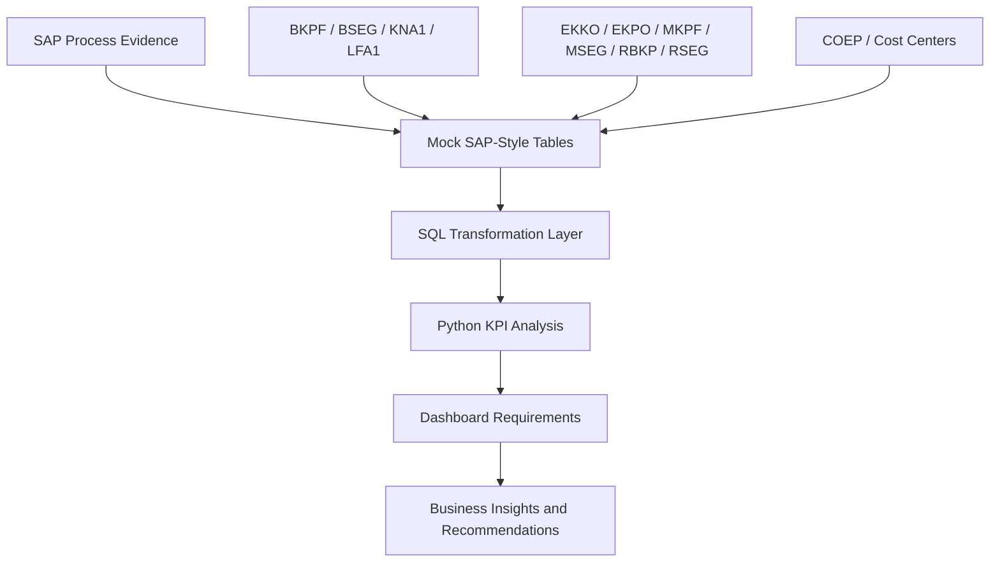

# Analytics Extension Roadmap

## Objective

This roadmap defines how the SAP S/4HANA portfolio can be extended into a stronger SQL, Python, and business analytics project without altering the original academic project files. The goal is to turn SAP process knowledge into practical analytics assets that can be demonstrated on GitHub.

---

## Recommended Analytics Architecture

---

## Phase 1 — SQL Portfolio Layer

### Deliverables

| Deliverable | Description | Business Value |
|---|---|---|
| `sql/01_fi_open_items.sql` | Query open vendor and customer balances | Supports payment and collection monitoring |
| `sql/02_mm_three_way_match.sql` | Compare PO, GR, and invoice quantities/amounts | Detects procurement exceptions |
| `sql/03_pp_production_variance.sql` | Compare target and actual production | Measures production execution performance |
| `sql/04_co_cost_center_actuals.sql` | Summarize cost center actual postings | Supports cost control and management reporting |

### Example SQL Questions to Answer

1. Which vendors have unpaid invoices by company code?
2. Which customers have outstanding balances by aging bucket?
3. Which purchase orders have quantity differences between PO, GR, and invoice?
4. Which cost centers have the highest actual expenses?
5. Which production orders delivered less than the target quantity?

---

## Phase 2 — Python Analytics Layer

### Deliverables

| Deliverable | Description | Business Value |
|---|---|---|
| `notebooks/fi_aging_analysis.ipynb` | Calculate aging buckets for A/R and A/P | Improves working capital visibility |
| `notebooks/procurement_exception_analysis.ipynb` | Identify duplicate POs, price variance, and invoice mismatches | Reduces procurement leakage |
| `notebooks/production_kpi_analysis.ipynb` | Analyze output, shortages, and production variance | Improves planning reliability |
| `notebooks/cost_center_dashboard_prep.ipynb` | Prepare cost center KPI tables | Supports managerial accounting review |

### Recommended Python Libraries

| Library | Purpose |
|---|---|
| `pandas` | Data cleaning, joins, grouping, KPI calculations |
| `numpy` | Numeric operations and variance calculations |
| `matplotlib` / `seaborn` | Basic charts for portfolio notebooks |
| `sqlalchemy` | Optional database connection layer |
| `jupyter` | Notebook-based analytics presentation |

---

## Phase 3 — Power BI or Dashboard Design

### Suggested Dashboard Pages

| Page | Audience | Core KPIs |
|---|---|---|
| Executive Overview | Management | Open A/R, open A/P, procurement exceptions, production completion |
| Finance | Accounting team | Vendor balances, customer balances, cost center actuals |
| Procurement | Purchasing team | PO cycle time, three-way match exceptions, vendor price variance |
| Production | Operations team | Target vs. produced quantity, shortages, finished goods receipt |
| HR | HR team | Qualification coverage, hiring actions, position structure |

---

## Data Modeling Recommendation

Use a simple star-schema mindset for analytics demonstrations:

| Table Type | Example Tables | Purpose |
|---|---|---|
| Fact tables | Accounting line items, PO items, goods movements, invoice items, production confirmations | Store measurable business events |
| Dimension tables | Vendor, customer, material, company code, plant, cost center, employee | Describe who, what, where, and organizational context |
| Calendar table | Date dimension | Enables month, quarter, year, and aging analysis |

---

## Priority Build Order

| Priority | Build Item | Reason |
|---|---|---|
| 1 | SQL queries for FI and MM | Best match for accounting + ERP analytics roles |
| 2 | Mock SAP-style sample data | Makes the repo runnable without SAP system access |
| 3 | Python KPI notebooks | Demonstrates data analytics capability |
| 4 | Dashboard requirements document | Shows business analyst communication skills |

---

## Quality Standards for Future Analytics Work

- Keep SAP-style table names where useful, but explain them in plain business language.
- Include business questions before writing SQL or Python.
- Document assumptions clearly when using mock data.
- Separate raw data, transformed data, queries, notebooks, and reports.
- Include KPI definitions so non-technical readers understand the analysis.
- Avoid overcomplicated code; prioritize readability and business meaning.

---

## Target Outcome

After completing this roadmap, the portfolio would show a strong combination of:

- SAP business process execution.
- Accounting and finance domain knowledge.
- ERP data model understanding.
- SQL querying capability.
- Python analytics capability.
- Dashboard and KPI design thinking.

That combination is highly relevant for entry-level and junior roles in ERP analysis, SAP support, business analytics, financial systems, procurement analytics, and data analytics.
